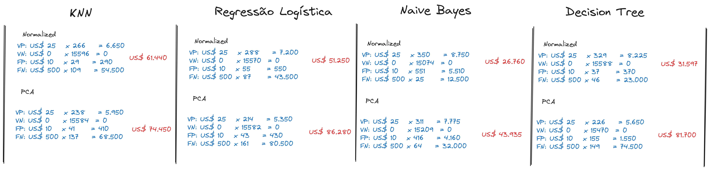
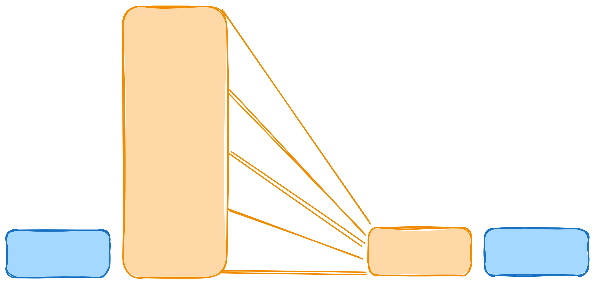
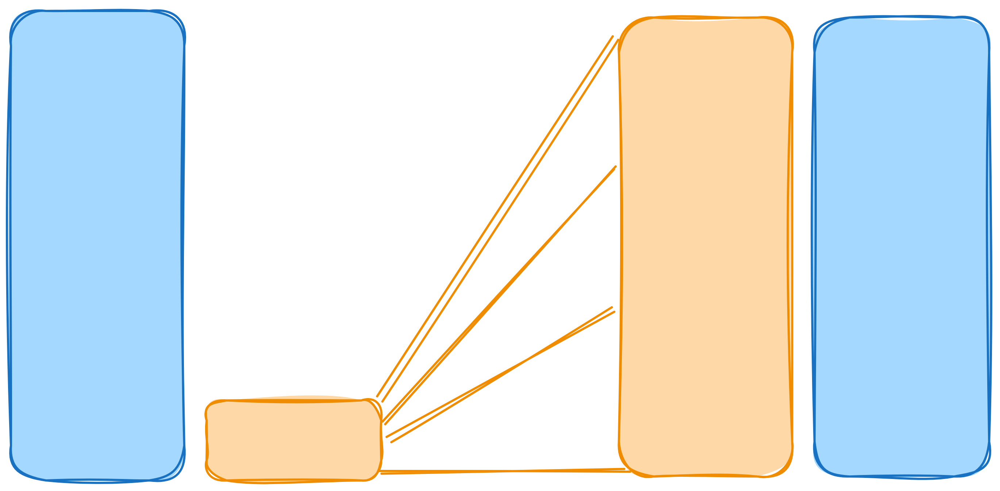
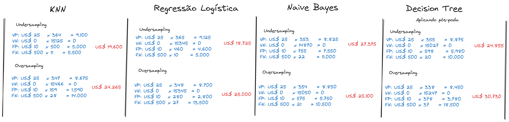

# Desafio Bix Tecnologia

## Descrição do Problema

Uma empresa possui uma frota de veículos e viu seus custos de manutenção no sistema de ar subindo nos últimos.

- Consertar caminhão com defeito: US$ 25,00
- Caminhão sem defeito na oficina: US$ 10,00
- Caminhão com defeito sem reparo: US$ 500,00

## Desafio

Como reduzir os custos de manutenção do sistema de ar dos caminhões dessa empresa?

## Solução

Construir um modelo de Machine Learning capaz de classificar quais caminhões precisão realizar a manutenção no sistema de ar.

## Pré Processamento

Para realizar a próximas etapas os dados vão precisar ser processados para tratar algumas inconcistências e separações.

Existem dois grupos de dados:

- `air_system_previous_years.csv`: Arquivo contendo todas as informações do setor de manutenção para anos anteriores a 2022. (60.000)
- `air_system_present_year.csv`: Arquivo que contém todas as informações d o setor de manutenção nesse ano. (16.000)

Os valores ausentes no banco de dados foram substituidos pela mediana daquela coluna na classe que aquele registro pertence.

Os dados foram divididos da seguinte forma:

- Treinamento: 75% de `air_system_previous_years.csv` (45.000)
- Teste: 25% de `air_system_previous_years.csv` (15.000)
- Validação: 100% de `air_system_present_year.csv` (16.000)

Os dados de treinamento foram normalizados e em seguida a transformação foi aplicada nos dados de Teste e Validação.

Foi utilizada uma abordagem de PCA com o objetivo de diminuir a dimensionalidade dos dados, embora os testes serão feitos com dimensionalidade completa e reduzida.

## Classificação

Nessa etapa serão testados alguns modelos que implementam diferentes abordagens para o problema.

Esses modelos são: KNN, Regressão Logística, Naive Bayes e Decision Tree

### KNN

Esse modelo foi implementado com o número de vizinhos igual a 3.

#### Com todas as variáveis apresentou os seguintes resultados no teste:

Acurária: 0.99

Precisão: 0.92

Recall: 0.84

Matrix de Confusão:

|real \ predito| neg   | pos   |   
|:------------:|:-----:|:-----:| 
|neg           |14713  |33     |
|pos           |79     |175    |

    
#### Com as variáveis PCA (n=20) normalizadas:

Acurária: 0.99

Precisão: 0.90

Recall: 0.86

Matriz de Confusão:

|real \ predito| neg   | pos   |   
|:------------:|:-----:|:-----:| 
|neg           |14703  |43     |
|pos           |72     |182    |

### Regressão Logística

Nesse modelo foi definido o máximo de iterações como 4000 e o resolvedor "Saga"

#### Com todas as variáveis apresentou os seguintes resultados no teste:

Acurária: 0.99

Precisão: 0.91

Recall: 0.88

Matriz de Confusão:

|real \ predito| neg   | pos   |   
|:------------:|:-----:|:-----:| 
|neg           |14705  |41     |
|pos           |58     |196    |

#### Com as variáveis PCA (n=20) normalizadas:

Acurária: 0.99

Precisão: 0.88

Recall: 0.78

Matriz de Confusão:

|real \ predito| neg   | pos   |   
|:------------:|:-----:|:-----:| 
|neg           |14702  |44     |
|pos           |110    |144    |

### Naive Bayes

Nesse modelo foi usada a implementação Gaussiana

#### Com todas as variáveis apresentou os seguintes resultados no teste:

Acurária: 0.96

Precisão: 0.64

Recall: 0.93

Matriz de Confusão:

|real \ predito| neg   | pos   |   
|:------------:|:-----:|:-----:| 
|neg           |14185  |561    |
|pos           |27     |227    |

#### Com as variáveis PCA (n=20) normalizadas:

Acurária: 0.97

Precisão: 0.67

Recall: 0.90

Matriz de Confusão:

|real \ predito| neg   | pos   |   
|:------------:|:-----:|:-----:| 
|neg           |14323  |423    |
|pos           |42     |212    |

### Decision Tree

Esse modelo foi implementado sem nenhuma restrição de poda

#### Com todas as variáveis apresentou os seguintes resultados no teste:

Acurária: 0.99

Precisão: 0.92

Recall: 0.84

Matriz de Confusão:

|real \ predito| neg   | pos   |   
|:------------:|:-----:|:-----:| 
|neg           |14713  |33     |
|pos           |82     |172    |

#### Com as variáveis PCA (n=20) normalizadas:

Acurária: 0.99

Precisão: 0.81

Recall: 0.84

Matriz de Confusão:

|real \ predito| neg   | pos   |   
|:------------:|:-----:|:-----:| 
|neg           |14646  |100    |
|pos           |81     |173    |

## Validação

Na etapa de validação dos modelos foram usados os dados separados para esse fim e também foram aplicadas as regras de negócio para visualizar a questão financeira e logística de cada modelo.

Assim os modelos que apresentaram o melhor desempenho financeiro foram:

|Posição | Modelo              | Custos (US$)| Acurácia | Precisão | Recall |  
|:------:|:-------------------:|:-----------:| :-------:|:--------:|:------:|
|1º      |Naive Bayes          |26.760       |0.96      | 0.69     | 0.95   |
|2º      |Decision Tree        |31.597       |0.99      | 0.95     | 0.94   |
|3º      |Regressão Logística  |51.250       |0.99      | 0.92     | 0.88   |
|4º      |KNN                  |61.440       |0.99      | 0.95     | 0.85   |

### Considerações

O Naive Bayes e o Decision Tree tiveram resultados bem interessantes do ponto de vista financeiro, devido a sua sensibilidade maior. 

O Naive Bayes tem uma peculiaridade na métrica de precisão que se traduzir em um comportamento de enviar muitos caminhões sem problema no sistema de ar para a oficina. Na descrição do problema atual isso pode não prejudicar, entretanto variações nos custos de cada cenário e/ou capacidade de operação da oficina podem tornar o modelo inviável.

O Decision Tree apresentou uma precisão significativamente melhor que o Naive Bayes, ficando assim, menos suceptível a variações nos custos e capacidade da oficina.

## Otimização

### Tratando desbalanceamento

As duas classes estão desbalanceadas, existe um número significativamente maior em uma das classes

Dados de Treinamento:

neg: 44254

pos: 746

#### Undersampling

Decrementa a quantidade de dados da classe majoritária no treinamento

Dados de Treinamento (Após decrementar):

neg: 746

pos: 746

#### Oversampling

Re-amostra dados da classe minoritária a fim de equilibrar os dados de treinamento

Dados de Treinamento (Após re-amostrar):

neg: 44254

pos: 44254

### Resultados da Otimização

Foram realizados testes usando as duas técnicas acima para analisar o desempenho dos modelos

|Posição | Modelo              | Técnica       | Custos (US$)| Acurácia | Precisão | Recall |  
|:------:|:-------------------:|:-------------:|:-----------:| :-------:|:--------:|:------:|
|1º      |Regressão Logística  | Undersampling |18.725       |0.97      | 0.72     | 0.97   |
|2º      |KNN                  | Undersampling |19.600       |0.97      | 0.71     | 0.97   |
|3º      |Decision Tree        | Undersampling |24.885       |0.96      | 0.69     | 0.95   |
|4º      |Naive Bayes          | Oversampling  |25.100       |0.95      | 0.66     | 0.95   |

Após os resultados utilizando essas técnicas alguns modelos apresentaram uma melhora significativa e os resultados ficaram mais próximos.

Uma observação geral é que todos os modelos tiveram uma piora na precisão, que acarreta a mesma questão citada anteriormente com o Naive Bayes, que pode sobrecarregar o setor da ofinica. Assim, seria interessante analisar essa relação de custos caso esse modelo realmente cause esse problema.

Olhando para a tabela acima é possível ver que o modelo de Regressão Logística e o KNN apresentaram resultados bem próximos e satisfatórios, apresentando as melhores métricas e a melhor redução dos custos.